# uwillno.com

---

## 语言

**readme_en.md机翻效果太差已经移除，请使用浏览器翻译。**  
**The machine translation of readme_en.md is too poor and has been removed. Please use a browser to translate it.**

## 介绍

用Qt开发的静态博客，并利用Cloudflare的服务实现一些动态功能。

### [主页](https://uwillno.com)

Cloudflare Pages上托管，~~仅并发请求不同静态托管站点的文件块并跳转第一个完成的托管站~~，已更改为Cloudflare站点。

我不管你访问快不快了，连不上就别用了，这只是个个人博客，又不是上班打开软件非上不可。

### 静态托管站

[Github](https://github.uwillno.com/) [Vercel](https://vercel.uwillno.com/) [Cloudflare](https://cloudflare.uwillno.com/) [EdgeOne](https://edgeone.uwillno.com/) [Netlify](https://netlify.uwillno.com/) [Azure](https://azure.uwillno.com/) [GitLab](https://gitlab.uwillno.com) [Render](https://render.uwillno.com) ~~[IPv6](https://ipv6.uwillno.com:9102/) [Tunnel](https://tunnel.uwillno.com/)~~

> IPV6/Tunnel站点本质为物理机上的一个Docker，也用于测试，如果访问时我正在测试，你可能体验到一些BUG。Tunnel站使用Cloudflare Tunnel穿透，IPV6站使用DDNS-GO。IPV6站点必须你具备IPV6才能访问，通常情况只适用于你用数据流量访问。
>
> **迁移至qt5#dev，停用IPV6 TUNNEL站**
>
> 由于WASM和一些资源很大，部分站点流量很容易被刷到上限，可以视情况切换站点访问。
>
> ~~HTML / CSS 由 [DeepSeek | 深度求索](https://www.deepseek.com/) 生成后微调的。（当初就是懒得写前端才用的Qt，别想让我手搓~~）
>
> 被迫手搓了一大段。

[测速跳转站（原主页）](https://blog.uwillno.com)

> 保留了一个，方便第三方使用。

### 静态功能可以直接体验，动态功能额外说明。

### AI摘要、评论/留言、朋友圈……

采用Cloudflare Workers、R2、D1实现，Workers内用到Resend服务给管理人员发邮件，因为没存储用户明文邮箱，用户不会收到邮件，也不用担心暴露。

### 服务器程序

Qt开发，采用Cloudflare Tunnel穿透，内置3个服务器，聊天服务器（ws，常关）、监控服务器（ws）、安卓服务器（http，有一个配套纯Java开发的APP，博客中只为手机监控提供数据）。

### 其它端（内部使用）

和WebAssembly端是一套源码。因为没跨域限制，多了一个设置镜像的功能，方便从不同静态托管站请求静态资源。Android上有额外的权限申请。PC端有生成RCC和RSS的功能。RCC是包含QML的，不用重新编译wasm即可更新内容，wasm只负责请求加载即可，所以这依旧是静态的，需要提交并推送。这也是数据统计里Other比较多的原因之一。

> 物理机出状况的话部分功能异常为正常现象。
>
> 可以说动态部分完全是依赖于Cloudflare的，计划有变的话，后续可能精简以确保博客能低成本运行。

## 近期改动

---

## 因一些原因，将逐步大量精简交互、布局、提示、历史信息……，不过会保证基本可用。

## 调整

- 机翻过于离谱，我没有精力校对，4.0移除大段落英文翻译（包括英文文章），需要看懂的可以学习下简体中文或者采用OCR翻译插件。
- 水印相机因安全问题被调整为仅内部使用，若需要可以拉出来单独整个webassembly版本，个人感觉没必要了，安卓版更好用。
- 表情/图片插入在留言和朋友圈仅内部使用，避免滥用，MD编辑里可用，其它文本编辑里未实现。
- 中文字体再次改为进入wasm后再加载，可选SarasaMono、NotoSans、MiSans。
- 不再更新WASM里的程序版本号，如果某次编译的dev分支很稳定，可能会一段时间不更新WASM了。

## 控件重写

4.4之后，对已使用的控件进行调整了重写，基于Template与Basic，配色与回退依旧采用Material Style，可能存在问题？

## 本站markdown语法扩展

见[这篇文章](https://uwillno.com?blog=87)。Latex适配差异：webassembly为同步，其它端为异步。

## 功能路由表

wasm平台特性，通过查询参数路由，常规路由见[rss.xml](rss.xml)，额外参数如下，只是方便自用或调试，故不对所有功能实现。

| 功能     | 值参数                                                 | 标志参数                | 示例                                                         | 备注                                     |
| -------- | ------------------------------------------------------ | ----------------------- | ------------------------------------------------------------ | ---------------------------------------- |
| 农历     | datetime=年-月-日-时                                   | 无                      | [?func=lunar&datetime=2026-05-13-10](https://uwillno.com?func=lunar&datetime=2026-05-13-10) | 无                                       |
| 皇极经世 | datetime=年-月-日-时                                   | male female             | [?func=hjjs&datetime=2026-05-13-10&male](https://uwillno.com?func=hjjs&datetime=2026-05-13-10&male) | 标志不要同时使用                         |
| 紫微斗数 | datetime=年-月-日-时                                   | male female             | [?func=zwds&datetime=2026-05-13-10&male](https://uwillno.com?func=zwds&datetime=2026-05-13-10&male) | 标志不要同时使用                         |
| 文件安全 | publicKey=公钥 secretKey=私钥 encKey=密钥              | 无                      | [?func=na&publicKey=hex&secretKey=hex&encKey=hex](https://uwillno.com?func=na&publicKey=d42a31e5cd755a330a141042d0c9614a310dcc158508ca445b650da5487c57ec&secretKey=b8957b22af024594cc1cbf6fa62ed8bddb98e6ea4061b9eaf4032ceb18d4d00ed42a31e5cd755a330a141042d0c9614a310dcc158508ca445b650da5487c57ec&encKey=68f26ee52032c8996647294cfa9bbf3cf3be11a5b6b2d2b8db5ce5add27d9784) | 无                                       |
| MD编辑   | content=md字符串 content_b64=md的base64 source=md的url | preview（直接进入预览） | [?func=mdeditor&source=https://uwillno.com/README.md&preview](https://uwillno.com/?func=mdeditor&source=https://uwillno.com/README.md&preview) | 值不建议同时使用，不处理相对路径，cors   |
| MD预览   | content=md字符串 content_b64=md的base64 source=md的url | 无                      | [?func=md&source=https://uwillno.com/README.md](https://uwillno.com/?func=md&source=https://uwillno.com/README.md) | 会根据source处理部分相对路径，cors       |
| 纯净模式 | 无                                                     | PURE                    | [?func=md&source=https://uwillno.com/README.md&PURE](https://uwillno.com/?func=md&source=https://uwillno.com/README.md&PURE) | 务必同时使用其他路由。部分功能可能不工作 |

## 通用RCC/QML/CODE加载器

从原始代码，你需要使用;换行

> [https://uwillno.com/?code=import%20QtQuick;%20Window{%20visible:true;%20color:%20%22red%22;%20width:%20100;%20height:%20100;%20}](https://uwillno.com/?code=import%20QtQuick;%20Window{%20visible:true;%20color:%20%22red%22;%20width:%20100;%20height:%20100;%20})

从base64代码

> [https://uwillno.com/?code_b64=aW1wb3J0IFF0UXVpY2s7CgpXaW5kb3d7CiAgICB2aXNpYmxlOnRydWUKICAgIGNvbG9yOiAicmVkIgogICAgd2lkdGg6IDEwMAogICAgaGVpZ2h0OiAxMDAKfQo=](https://uwillno.com/?code_b64=aW1wb3J0IFF0UXVpY2s7CgpXaW5kb3d7CiAgICB2aXNpYmxlOnRydWUKICAgIGNvbG9yOiAicmVkIgogICAgd2lkdGg6IDEwMAogICAgaGVpZ2h0OiAxMDAKfQo=)

从QMLURL 确保cors

> [https://uwillno.com/?qml=https://uwillno.com/test.qml](https://uwillno.com/?qml=https://uwillno.com/test.qml)

从RCCURL 确保cors 可以选entry=qrc:/main.qml指定入口，默认为qrc:/Main.qml
确保已编译 rcc -binary my.qrc -o my.rcc

> https://uwillno.com/?rcc=https://xxxx.com/my.rcc

从本地打开文件加载 支持qml和rcc 不带参数或加载失败或加载后退出都会进入该页面

> [https://uwillno.com/?rcc](https://uwillno.com/?rcc) 
>
> > ?code ?code_b64 ?qml 

加进博客了，但不要尝试加载我的rcc，因为我的rcc加入了一个校验来避免rcc和wasm模块不对应。这也是为什么本地使用需同时备份wasm和rcc。

## [图片格式转换](https://uwillno.com/?func=imgfmt)

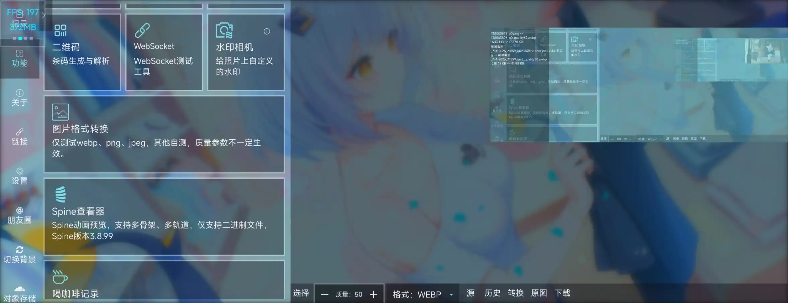

自用，这个预览图就是个示例，推荐优先WEBP。

## [MD编辑](https://uwillno.com/?func=mdeditor)

仅支持部分Markdown语法，对多媒体、表格、列表、引用……按个人习惯进行了扩展、增强，开销也更大（该场景未启用标题导航）。

默认为一次性完成全部解析和控件生成，对于正常博客文章是完全可以的，也可以避免一些抖动，不建议尝试即时预览嵌套过多或内容过长的文章（包括默认测试用例）。

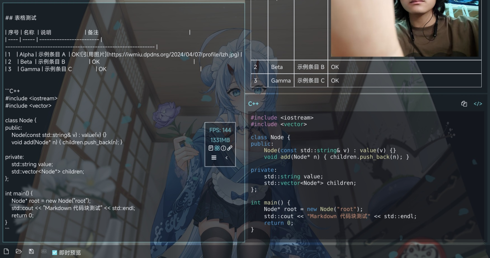

## [咖啡记录](https://uwillno.com?func=coffeelog)

文章里记录太不方便更新，所以专门移到功能页记录。~~（顺便试试多边形控件）~~

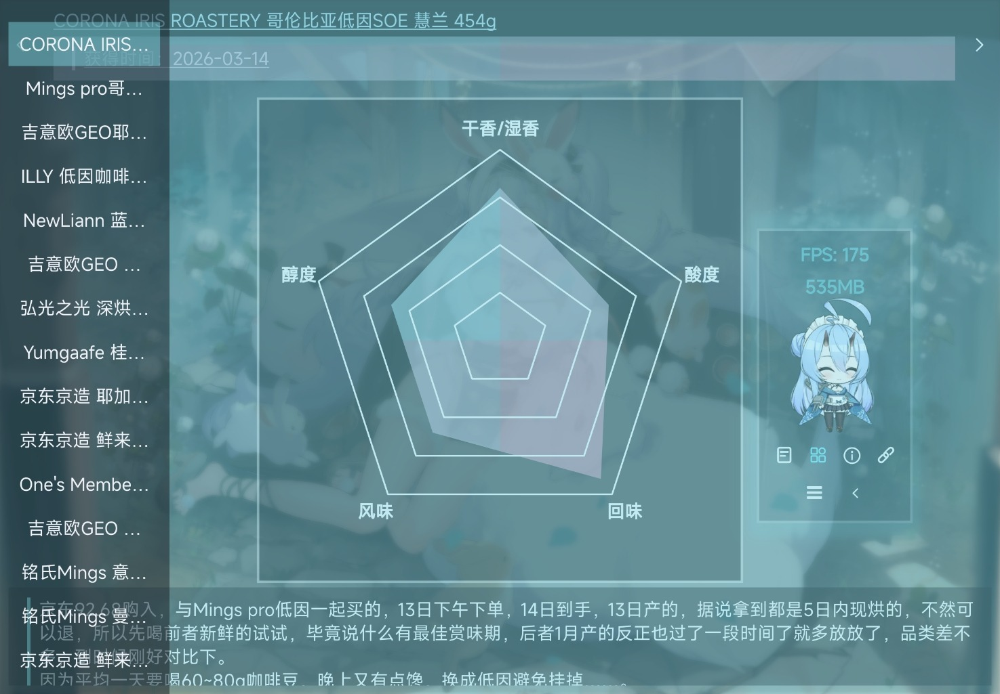

## 监视器

新增安卓监视器，手机性能太差，非长连接实现，不监视性能。

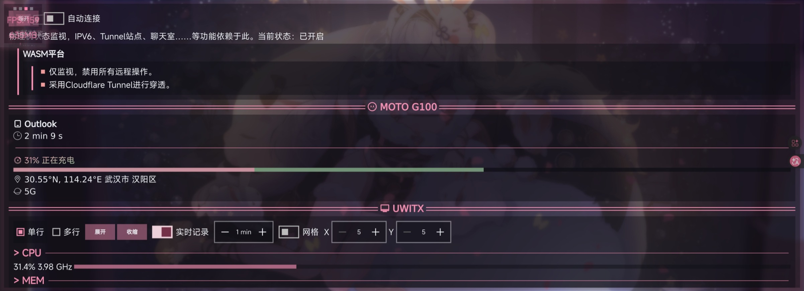

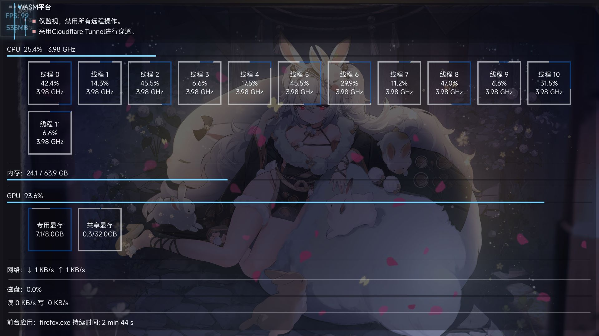

长按可展开/收缩。

## 文件压缩/解压

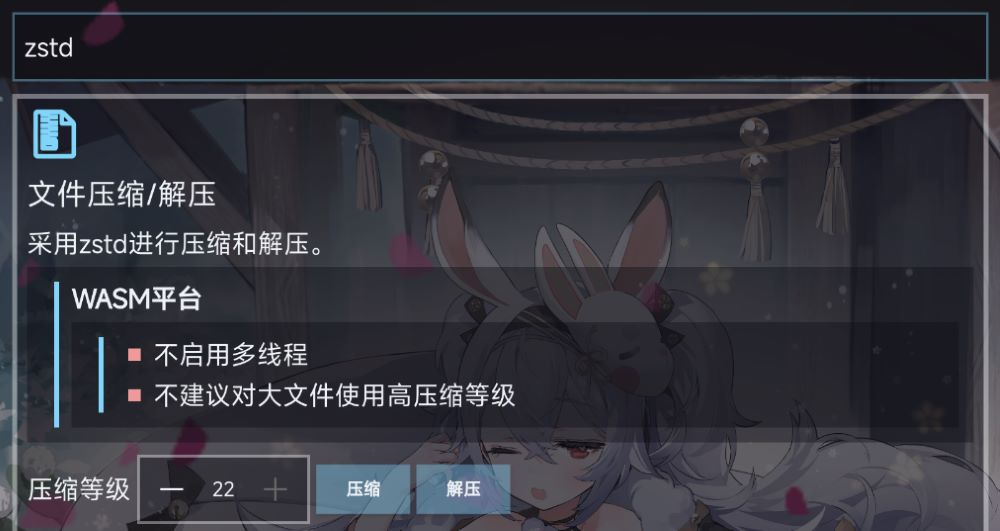

## 统计可视化

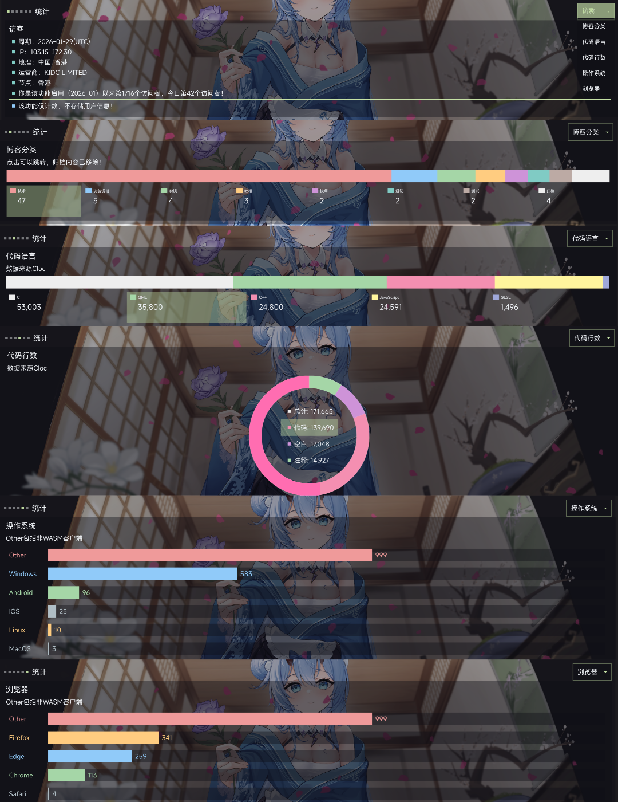

后续移除了外部库的代码统计，统计更加真实，包含全平台、归档代码、试验代码， 相对于特定平台整体行数可能偏多一些。

## 交互方式/监控

移除了主要导航栏、工具栏……统一所有平台交互（~~太多自定义或平台预设我觉得好混乱、繁琐~~）。改用一个悬浮按钮，完成所有操作。
### 长按收缩/展开
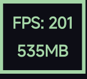

### 内存监控

WASM上记录为历史最高内存占用，如果接近4G或你的浏览器设备限制，及时释放一些后台任务，避免崩溃。

### 单击弹出操作抽屉

### 双击/右键单击返回

浏览器的返回和手势返回也可以触发

## 音乐播放器

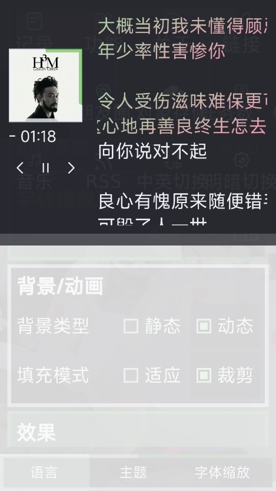

调整至抽屉方便交互，点击歌词调整进度，换掉了之前瞎眼的动态渐变，删掉了旋转效果。

## [文件安全](https://uwillno.com?func=na)

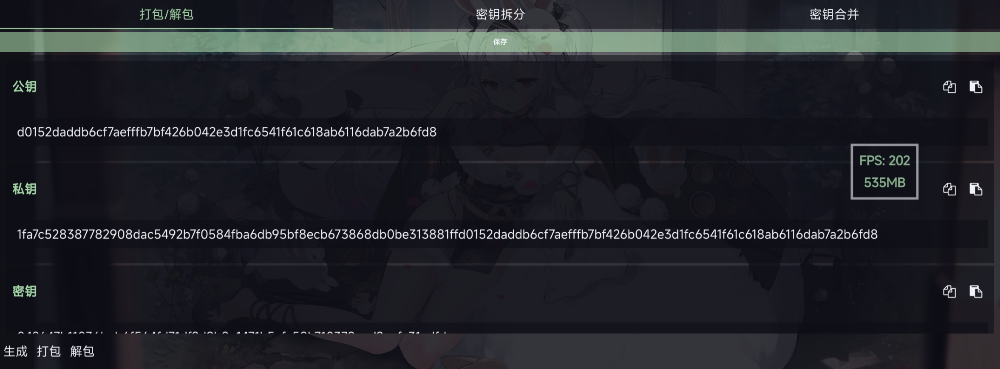

- 对文件进行打包解包（签名验签、加解密）

- 密钥拆分合并（XOR/Shamir）

## 后台任务

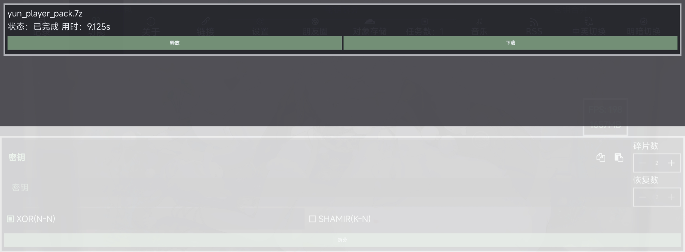

部分耗时操作放进后台其它线程处理，避免阻塞UI，处理过程中不影响其它操作，不过需要注意内存，及时释放。

## 历史

---

## [记录页](https://uwillno.com/?blog)

### [文章](https://uwillno.com/?blog)

纯静态，文章（markdown、~~html~~）、AI摘要

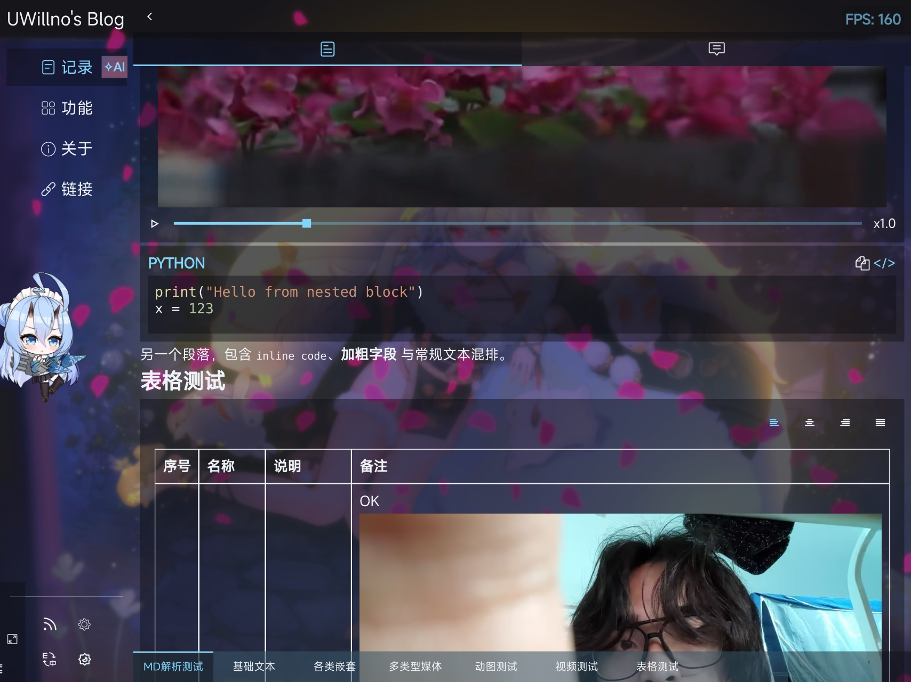

旧版

### [动态/朋友圈/时刻](https://uwillno.com/?moment)

内部使用的可随时发布编辑的短文。支持所有类型文件及媒体预览。

## [功能页](https://uwillno.com/?func)

玄学相关功能不~~建议~~采用真太阳时。

### [农历](https://uwillno.com/?func=lunar)

[lunar](https://6tail.cn/calendar/api.html)的调用。并不能很好的与Qt兼容，可能会有bug，报错信息已隐藏。

### [六爻](https://uwillno.com/?func=6yao)

排盘，远古版本直接迁移不保证可用。

### [小六壬](https://uwillno.com?func=6ren)

### [皇极经世](https://uwillno.com?func=hjjs)

按照书籍重写的算法，和天纪程式进行对照过，测试的用例结果都一致，异常用例可以发我看看。

### [天纪笔记](https://uwillno.com?func=tj)

数据来源未知，未校验。

### [紫微斗数](https://uwillno.com?func=zwds)

### [卡巴斯基密码管理器：txt转csv](https://uwillno.com?func=kpm)

### [身份验证器](https://uwillno.com?func=otp)

### [二维码生成与识别](https://uwillno.com?func=qr)

### [WebSocket测试工具/聊天室](https://uwillno.com?func=ws)

物理机服务器不定期启动

### [水印相机](https://uwillno.com?func=watermark)

仅实验，建议使用安卓版本[QWMC](https://github.com/uwillno/qwmc_template)

### [图片拼接](https://uwillno.com?func=imagestitching)

### [HTML编辑](https://uwillno.com?func=htmleditor)

### [文本编辑](https://uwillno.com?func=texteditor)

改自Qt官方示例 [Qt Quick Controls - Text Editor | Qt Quick Controls](https://doc.qt.io/qt-6/qtquickcontrols-texteditor-example.html)

### [AES](https://uwillno.com?func=aes)

### [个人排班查询](https://uwillno.com?func=pb)

### [周期排班推理](https://uwillno.com?func=pba)

### [Spine查看器](https://uwillno.com/?func=spine)

实测部分用例显示异常，经测试似乎除了C#版本，其它版本也存在类似问题，官方Skeleton Viewer、WebGL和其它cpp版本都显示异常，又是比较老的分支，修复应该是不太可能了。

## [关于页](https://uwillno.com?about)

部分内容更新不及时，因为开发者特别懒。

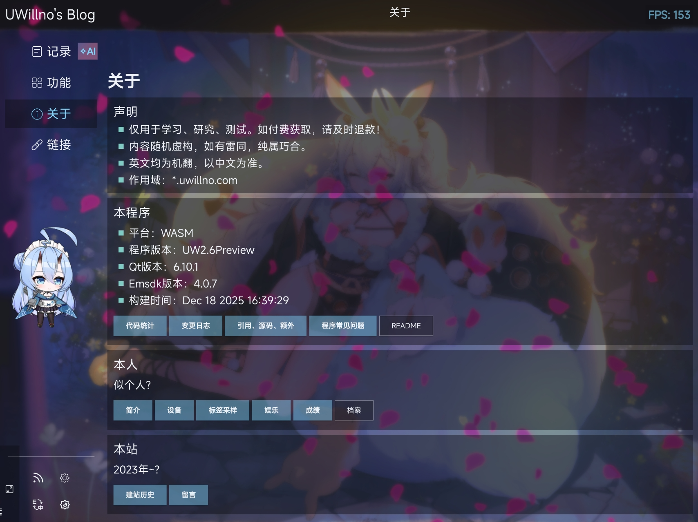

### 代码统计

路由地址已变，建议查阅[RSS](https://uwillno.com?rss)

## 旧版

### 本程序

### 本站历史/留言

### 本人

## [链接页](https://uwillno.com?links)

## 其它

### [RSS](https://uwillno.com?rss)

### 设置（粒子系统、效果、语言、主题、帧率显示、背景切换、音乐播放器开关）

### 明亮/黑暗模式

### 音乐播放器

### 主题设置

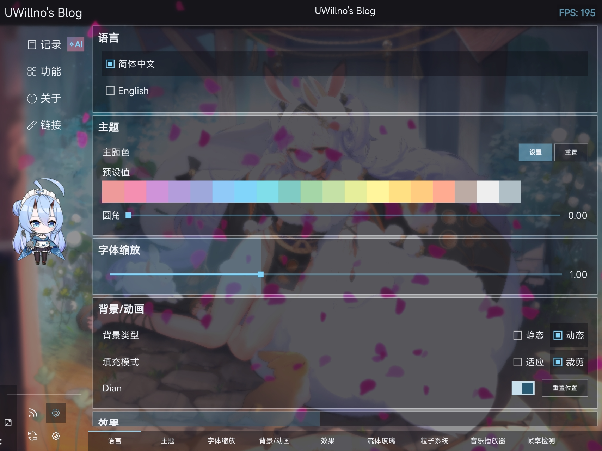

### 液态玻璃效果

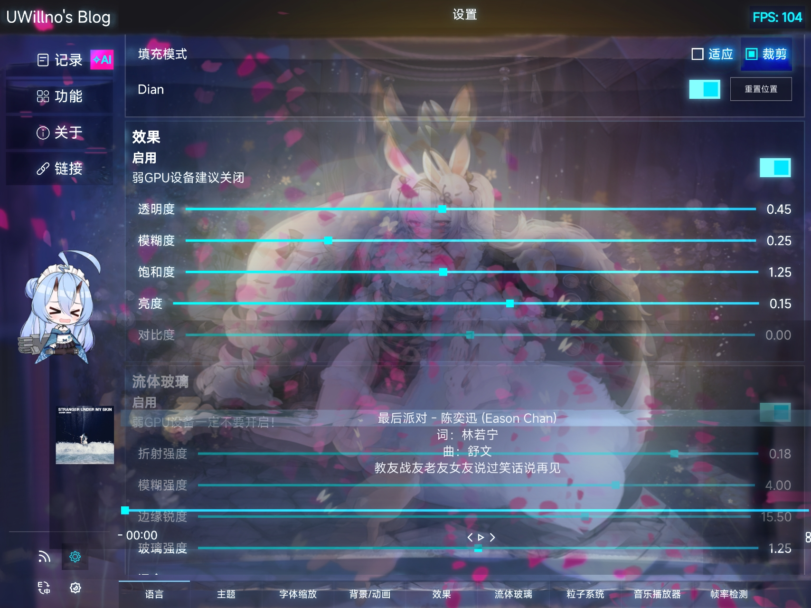

### 竖屏

### 横屏

### ……

## 引用

---

- [Qt](https://www.qt.io/)
- [emscripten](https://emscripten.org/)
- [Cloudflare](https://www.cloudflare.com/)
- [Github](https://github.com/)
- [coi-serviceworker](https://github.com/gzuidhof/coi-serviceworker)
- [Gravatar](https://gravatar.com/)
- [Qt-AES](https://github.com/bricke/Qt-AES/)
- [Lunar](https://6tail.cn/calendar/api.html)
- [DBWnl](https://github.com/jkinfeng/DBWnl)
- [fontello](https://fontello.com/)
- [iconfont](https://www.iconfont.cn/)
- [MiSans](https://hyperos.mi.com/font/zh/)
- [卡巴斯基](https://www.kaspersky.com)
- [碧蓝航线](https://game.bilibili.com/blhx/)
- [Esterv.Utils.QrCode](https://github.com/EddyTheCo/Esterv.Utils.QrCode)
- [spine-runtimes](https://github.com/EsotericSoftware/spine-runtimes/tree/4.2/spine-cpp)
- [zstd](https://github.com/facebook/zstd)
- [md4c](https://github.com/mity/md4c)
- [libsodium](https://github.com/jedisct1/libsodium)
- [fzstd](https://github.com/101arrowz/fzstd)
- [Noto - Google Fonts](https://fonts.google.com/noto)
- [Sarasa-Gothic](https://github.com/be5invis/Sarasa-Gothic)
- [Tailwind CSS](https://tailwindcss.com/)
- [Alpine.js](https://alpinejs.dev/)
- [Noto Emoji - Google Fonts](https://fonts.google.com/noto/specimen/Noto+Emoji)
- [MathJax](https://www.mathjax.org/)
- ……
- 包括但不限于以上内容，可能已经不存在于当前版本，但曾经使用或参考过。

## 源码

---

- [rccloader](https://github.com/UWillno/rccloader)
- [spine-qt](https://github.com/UWillno/spine-qt)
- ……
- 还有一些可能得翻下仓库或其它分支，部分可能已经不存在于当前版本。

## **近期监测到大量异常行为，暂时没造成影响，将部分仓库设为私有了，并进行了一些额外处理。**

## 性能问题

如果你设备足够好可以忽略。

部分功能确实是需要一定的CPU、GPU性能，但对于主流设备正常使用压力不算很高，尤其是CPU方面主流PC设备肯定够用了，若PC端具备显卡仍帧率不足30（骁龙7sgen2的adreno710都可以轻松达到的水平）或经常波动到10以下，建议排查以下内容：

- 硬件加速是否开启、节能模式是否关闭(浏览器和系统)
- 是否受windows效率模式影响
- 核显较弱的情况下是否调用了独显（尤其是一些老的轻薄本）
- 睿频是否正常
- ……

这是我在i7-8565U + MX250设备上测试时发现的，具体如何操作需要自行搜索。

## 额外

---

- .wasm文件比较大，注意流量消耗，部分地区需要代理访问
- 很多BUG是Qt框架自身的，部分模块处于技术预览阶段，偶尔会折腾升级Qt版本导致不稳定
- 已放弃兼容Android WebView，改用多线程构建以提高运行效率
- 域名对于我已经是不小的开销了，而且对于Qt for WASM应用能实现静态托管已经是很不容易了，最好的选择是克隆仓库本地部署运行（十分简单，[官方文档](https://doc.qt.io/qt-6/zh/wasm.html#running-applications)中提到了很多种方法）。 
- 由于静态托管与前端的特性，任何防护几乎无用，逆向是非常容易的，而且我的关键代码和无服务器的动态逻辑已经开源。 我的隐私倒不在意，但是请大佬不要对API进行攻击，我很穷的，没能力支付任何付费计划的账单。若发现严重的安全漏洞请及时与我联系，十分感谢。  
- 想要一些比较好实现或者已有功能的改进可以提出来，有空的话可能可以尝试写着玩。　
- 欢迎测试（我的bug我尽量抽空解决；框架的bug及时去官方反馈，有时修复周期特别长，难得有很稳定的版本，也不是总能编码回避的……）和申请友链。
- 仓库容易过大，不定期会清空一次，想使用固定版本的做好本地备份。
- 上面内容可能失效或改变。

## 历史版本

原本都保留在仓库的，最近缩减下仓库大小，移除了，截图纪念下。

### widgets版本

大学时尝试Qt for webassembly乱写的，只有几个自用功能。

### 1.0.5Preview

基于Qt Quick重新开发，多线程构建。后期过于混乱，难以维护，故重构。

