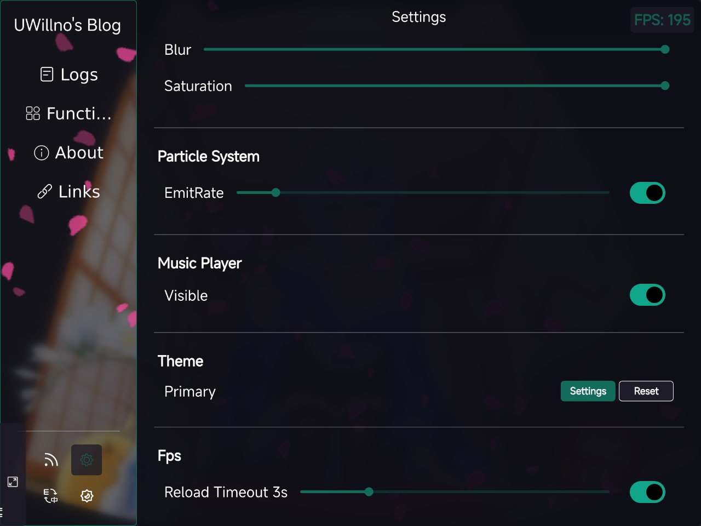
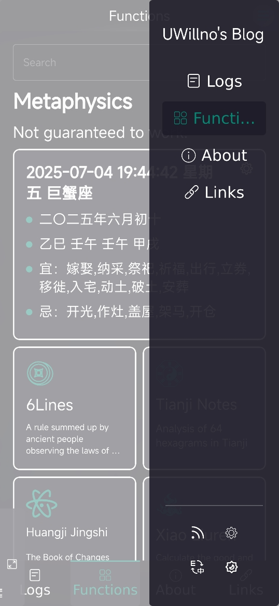
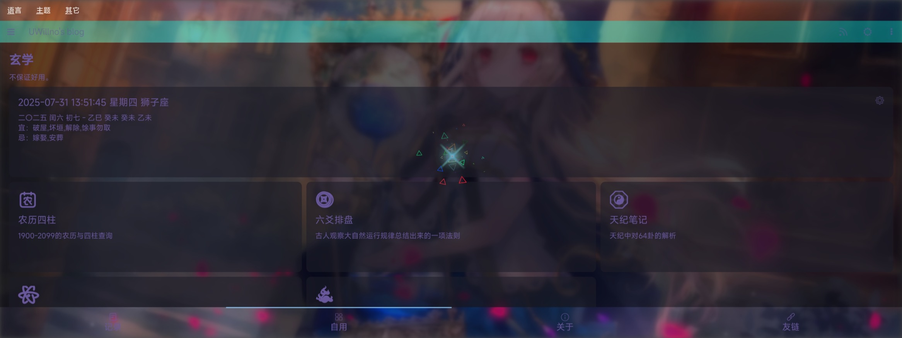

# uwillno.github.io / uwillno.com

---

## 语言

**readme_en.md机翻效果太差已经移除，请使用浏览器翻译。**  
**The machine translation of readme_en.md is too poor and has been removed. Please use a browser to translate it.**

## 介绍

- 一个基于Qt for WebAssembly开发的静态博客系统，内置一些奇怪的功能
- 用于个人、组织、沙雕……的娱乐、技术尝试、学习研究、教育……
- 内容包括不限于个人、组织、沙雕、玄学、不正确、虚构……无辨别能力者不建议访问

## 近期改动

---

## 监视器

长按可展开/收缩。

## 文件压缩/解压

## 统计可视化

后续移除了外部库的代码统计，统计更加真实，包含全平台、归档代码、试验代码， 相对于特定平台整体行数可能偏多一些。

## 交互方式/监控

移除了主要导航栏、工具栏……统一所有平台交互（~~太多自定义或平台预设我觉得好混乱、繁琐~~）。改用一个悬浮按钮，完成所有操作。
### 长按收缩/展开

### 内存监控

WASM上记录为历史最高内存占用，如果接近4G或你的浏览器设备限制，及时释放一些后台任务，避免崩溃。

### 单击弹出操作抽屉

### 双击/右键单击返回

浏览器的返回和手势返回也可以触发（**安卓类原生返回/单手模式还原会导致WASM触摸丢失**）

## 音乐播放器

调整至抽屉方便交互，点击歌词调整进度，换掉了之前瞎眼的动态渐变，删掉了旋转效果。

## [文件安全](https://uwillno.com?func=na)

- 对文件进行打包解包（签名验签、加解密）

- 密钥拆分合并（XOR/Shamir）

## 后台任务

部分耗时操作放进后台其它线程处理，避免阻塞UI，处理过程中不影响其它操作，不过需要注意内存，及时释放。

## 历史

---

## [记录页](https://uwillno.com/?blog)

### [文章](https://uwillno.com/?blog)

纯静态，文章（markdown~~、html~~）、AI摘要

旧版

### [动态/朋友圈/时刻](https://uwillno.com/?moment)

内部使用的可随时发布编辑的短文。支持所有类型文件及媒体预览。

## [功能页](https://uwillno.com/?func)

玄学相关功能不~~建议~~采用真太阳时。

### [农历](https://uwillno.com/?func=lunar)

[lunar](https://6tail.cn/calendar/api.html)的调用。并不能很好的与Qt兼容，可能会有bug，报错信息已隐藏。

### [六爻](https://uwillno.com/?func=6yao)

排盘，远古版本直接迁移不保证可用。

### [小六壬](https://uwillno.com?func=6ren)

### [皇极经世](https://uwillno.com?func=hjjs)

按照书籍重写的算法，和天纪程式进行对照过，测试的用例结果都一致，异常用例可以发我看看。

### [天纪笔记](https://uwillno.com?func=tj)

数据来源未知，未校验。

### [紫微斗数](https://uwillno.com?func=zwds)

### [卡巴斯基密码管理器：txt转csv](https://uwillno.com?func=kpm)

### [身份验证器](https://uwillno.com?func=otp)

### [二维码生成与识别](https://uwillno.com?func=qr)

### [WebSocket测试工具/聊天室](https://uwillno.com?func=ws)

物理机服务器不定期启动

### [水印相机](https://uwillno.com?func=watermark)

仅实验，建议使用安卓版本[QWMC](https://github.com/uwillno/qwmc_template)

### [图片拼接](https://uwillno.com?func=imagestitching)

### [HTML编辑](https://uwillno.com?func=htmleditor)

### [文本编辑](https://uwillno.com?func=texteditor)

改自Qt官方示例 [Qt Quick Controls - Text Editor | Qt Quick Controls](https://doc.qt.io/qt-6/qtquickcontrols-texteditor-example.html)

### [AES](https://uwillno.com?func=aes)

### [个人排班查询](https://uwillno.com?func=pb)

### [周期排班推理](https://uwillno.com?func=pba)

### [Spine查看器](https://uwillno.com/?func=spine)

## [关于页](https://uwillno.com?about)

部分内容更新不及时，因为开发者特别懒。

### 代码统计

路由地址已变，建议查阅[RSS](https://uwillno.com?rss)

## 旧版

### 本程序

### 本站历史/留言

### 本人

## [链接页](https://uwillno.com?links)

## 其它

### [RSS](https://uwillno.com?rss)

### 设置（粒子系统、效果、语言、主题、帧率显示、背景切换、音乐播放器开关）

### 明亮/黑暗模式

### 音乐播放器

### 主题设置

### 液态玻璃效果

### 竖屏

### 横屏

### ……

## 注意

- .wasm文件比较大，注意流量消耗，部分地区需要代理访问
- 很多BUG是Qt框架自身的，部分模块处于技术预览阶段，偶尔会折腾升级Qt版本导致不稳定
- 已放弃兼容Android WebView，改用多线程构建以提高运行效率
- 上面内容可能失效或改变。

## 引用

---

- [Qt](https://www.qt.io/)
- [emscripten](https://emscripten.org/)
- [Cloudflare](https://www.cloudflare.com/)
- [Github](https://github.com/)
- [coi-serviceworker](https://github.com/gzuidhof/coi-serviceworker)
- [Gravatar](https://gravatar.com/)
- [Qt-AES](https://github.com/bricke/Qt-AES/)
- [Lunar](https://6tail.cn/calendar/api.html)
- [DBWnl](https://github.com/jkinfeng/DBWnl)
- [fontello](https://fontello.com/)
- [iconfont](https://www.iconfont.cn/)
- [MiSans](https://hyperos.mi.com/font/zh/)
- [卡巴斯基](https://www.kaspersky.com)
- [碧蓝航线](https://game.bilibili.com/blhx/)
- [Esterv.Utils.QrCode](https://github.com/EddyTheCo/Esterv.Utils.QrCode)
- [spine-runtimes](https://github.com/EsotericSoftware/spine-runtimes/tree/4.2/spine-cpp)
- ……
- 包括但不限于以上内容，可能已经不存在于当前版本，但曾经使用或参考过。

## 源码

---

- [rccloader](https://github.com/UWillno/rccloader)
- [spine-qt](https://github.com/UWillno/spine-qt)
- [QWMC_template](https://github.com/UWillno/QWMC_template)
- [QmlRoundedImage](https://github.com/UWillno/QmlRoundedImage)
- [QmlCardRow](https://github.com/UWillno/QmlCardRow)
- [commentSystem](https://github.com/UWillno/commentSystem)
- [moment](https://github.com/UWillno/myWorkers/blob/main/momentD1.js)
- ……

## 额外

---

域名对于我已经是不小的开销了，而且对于Qt for WASM应用能实现静态托管已经是很不容易了，最好的选择是克隆仓库本地部署运行（仅仅需要一个`mkcert`和`python http.server `）。  
由于静态托管与前端的特性，任何防护几乎无用，逆向是非常容易的，而且我的关键代码和无服务器的动态逻辑已经开源。  
我的隐私倒不在意，但是请大佬不要对API进行攻击，我很穷的，没能力支付任何付费计划的账单。  
若发现严重的安全漏洞请及时与我联系，十分感谢。

## 历史版本

原本都保留在仓库的，最近缩减下仓库大小，移除了，截图纪念下。

### widgets版本

大学时尝试Qt for webassembly乱写的，只有几个自用功能。

### 1.0.5Preview

基于Qt Quick重新开发，多线程构建。后期过于混乱，难以维护，故重构。

